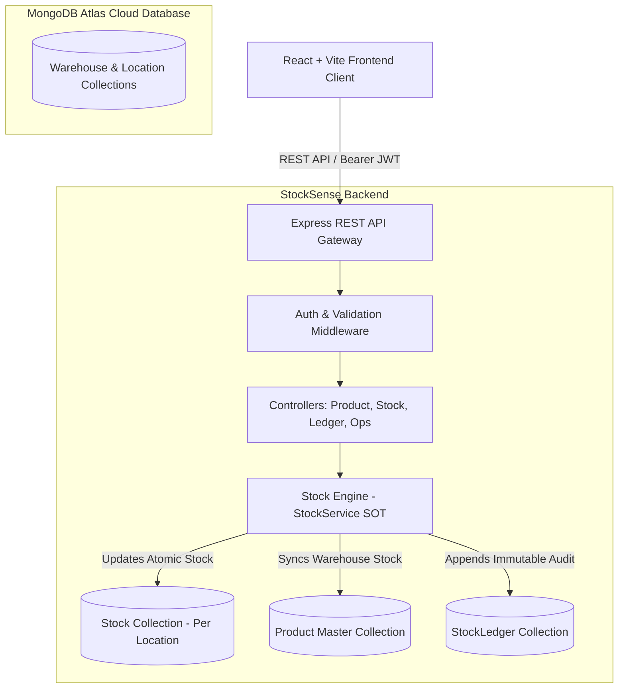
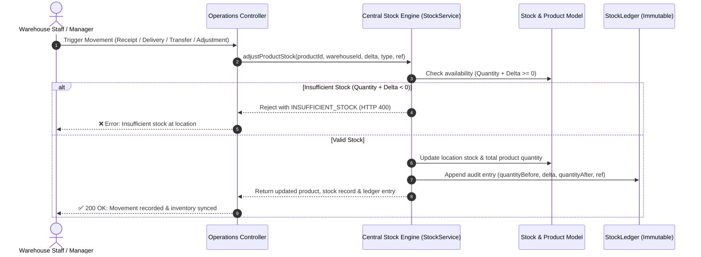

# 📦 StockSense — Smart Inventory & Stock Engine Management System

**StockSense** is an enterprise-ready, modular Inventory and Warehouse Operations Management platform inspired by Odoo ERP principles. It provides a centralized, real-time single source of truth for stock calculations, multi-location inventory tracking, automated reorder triggers, physical inventory reconciliation, and an immutable double-entry stock ledger.

---

## 🏛️ System Architecture



---

## 🔄 Central Stock Engine Lifecycle

All inventory mutations pass through the **Stock Engine (`StockService`)**, preventing race conditions, enforcing non-negative inventory, and ensuring every movement is auditable.



---

## 📊 Core Data Models & Schema Overview

| Entity | Collection | Key Fields | Constraints / Indexes |
| :--- | :--- | :--- | :--- |
| **Product** | `products` | `name`, `sku`, `category`, `costPrice`, `sellingPrice`, `totalQuantity`, `minReorderLevel`, `warehouseStock` | Unique `sku` (uppercase), search index on `name` |
| **Stock** | `stocks` | `product`, `warehouse`, `location`, `quantity`, `reservedQuantity`, `availableQuantity` | Compound Unique: `{ product, warehouse, location }` |
| **Location** | `locations` | `warehouse`, `name`, `code`, `type` (`STORAGE`, `PRODUCTION`, `DAMAGED`, `RECEIVING`, `SHIPPING`) | Compound Unique: `{ warehouse, code }` |
| **Warehouse**| `warehouses` | `name`, `code`, `location` (address, city), `capacity`, `manager` | Unique `code` (uppercase) |
| **Category** | `categories` | `name`, `code`, `description`, `isActive` | Unique `name`, soft-deletion guard |
| **Stock Ledger**| `stockledgers` | `transactionType`, `product`, `warehouse`, `location`, `quantityChange`, `previousQuantity`, `newQuantity` | **Immutable & Append-Only** (updates/deletions blocked) |
| **Reorder Rule**| `reorderrules` | `product`, `warehouse`, `location`, `minimumQuantity`, `maximumQuantity` | Compound Index: `{ product, warehouse, location }` |

---

## ⚖️ Stock Engine Invariants

| Operation | Movement Type | Invariant Mathematical Formula | Ledger Record |
| :--- | :--- | :--- | :--- |
| **Initial Stock** | `INITIAL_STOCK` | $\text{Initial} \ge 0$, $\text{New} = \text{Prev} + \text{Initial}$ | `0 -> InitialStock` |
| **Receipt Validation** | `RECEIPT` | $\text{Quantity} > 0$, $\text{New} = \text{Prev} + \text{Received}$ | $\text{Prev} \to \text{New}$ ($+\Delta$) |
| **Delivery Dispatch** | `DELIVERY` | $\text{Available} \ge \text{Delivered}$, $\text{New} = \text{Prev} - \text{Delivered}$ | $\text{Prev} \to \text{New}$ ($-\Delta$) |
| **Internal Transfer** | `TRANSFER_IN` / `OUT` | $\text{Source}_{\text{new}} + \text{Dest}_{\text{new}} \equiv \text{Source}_{\text{prev}} + \text{Dest}_{\text{prev}}$ | Preserves Total Stock |
| **Physical Adjustment**| `ADJUSTMENT` | $\Delta = \text{Counted} - \text{System}$, $\text{New} = \text{Counted}$ | Discrepancy logged |

---

## 🔌 API Endpoints Matrix

### Products (`/api/products`)
| Method | Endpoint | Description | Auth Required |
| :--- | :--- | :--- | :--- |
| `GET` | `/api/products` | Filterable product master list (Search, Category, Status, Warehouse) | Yes |
| `GET` | `/api/products/:id` | Single product details with populated stock breakdown | Yes |
| `POST`| `/api/products` | Create product (allocates initial stock to location & logs ledger) | Yes |
| `PUT` | `/api/products/:id` | Update metadata (stock quantity cannot be edited directly) | Yes |
| `DELETE`| `/api/products/:id` | Safe soft-deactivation preserving historical audits | Yes |
| `GET` | `/api/products/:id/stock` | Detailed stock levels across all warehouses & locations | Yes |
| `GET` | `/api/products/:id/availability` | Location-specific available stock | Yes |
| `GET` | `/api/products/:id/ledger` | Dedicated audit ledger for a specific product | Yes |

### Stock Engine (`/api/stock`)
| Method | Endpoint | Description | Auth Required |
| :--- | :--- | :--- | :--- |
| `GET` | `/api/stock` | Location-level stock master table with status badges | Yes |
| `GET` | `/api/stock/summary` | Aggregated dashboard KPI totals (valuation, low-stock, warehouses) | Yes |
| `GET` | `/api/stock/low` | Products currently at or below their reorder threshold | Yes |
| `GET` | `/api/stock/out-of-stock` | Products with zero on-hand quantity | Yes |
| `POST`| `/api/stock/transfer` | Inter-warehouse / location transfer preserving total inventory | Yes |
| `POST`| `/api/stock/adjust` | Reconcile physical count differences into inventory | Yes |
| `POST`| `/api/stock/increase` | Receipt helper for inbound inventory addition | Yes |
| `POST`| `/api/stock/decrease` | Delivery helper for outbound order fulfillment | Yes |
| `GET` | `/api/stock/ledger` | Comprehensive double-entry audit history | Yes |

### Configurations (`/api/categories`, `/api/locations`, `/api/warehouses`, `/api/reorder-rules`)
| Method | Endpoint | Description |
| :--- | :--- | :--- |
| `GET`, `POST` | `/api/categories` | Manage product classifications |
| `GET`, `POST` | `/api/warehouses` | Multi-warehouse master records |
| `GET`, `POST` | `/api/locations` | Sub-warehouse storage bins, racks, and production zones |
| `GET`, `POST` | `/api/reorder-rules` | Automated min-max stock alert rules |

### Operations & Auth (Member 4 — `/api/auth`, `/api/receipts`, `/api/deliveries`, `/api/transfers`, `/api/dashboard`)
| Method | Endpoint | Description | Auth Required |
| :--- | :--- | :--- | :--- |
| `POST` | `/api/auth/signup` | Register new user with optional role/warehouse assignment | No |
| `POST` | `/api/auth/login` | Authenticate user and receive JWT session token | No |
| `POST` | `/api/auth/logout` | Session logout endpoint | No |
| `POST` | `/api/auth/forgot-password` | Request password reset OTP | No |
| `POST` | `/api/auth/reset-password` | Verify OTP and reset password | No |
| `GET`  | `/api/auth/me` | Fetch authenticated user profile and permissions | Yes |
| `GET`  | `/api/receipts` | List inbound supplier shipments with filters | Yes |
| `POST` | `/api/receipts` | Create inbound receipt draft | Yes |
| `GET`  | `/api/receipts/:id` | Get receipt order details | Yes |
| `PUT`  | `/api/receipts/:id` | Update draft receipt order | Yes |
| `POST` | `/api/receipts/:id/validate` | Validate receipt, increase stock via StockEngine, log ledger | Yes |
| `GET`  | `/api/deliveries` | List outbound customer deliveries | Yes |
| `POST` | `/api/deliveries` | Create outbound delivery order draft | Yes |
| `GET`  | `/api/deliveries/:id` | Get delivery order details | Yes |
| `PUT`  | `/api/deliveries/:id` | Update draft delivery order | Yes |
| `POST` | `/api/deliveries/:id/validate` | Pre-check stock, deduct inventory, log ledger | Yes |
| `GET`  | `/api/transfers` | List inter-warehouse transfers | Yes |
| `POST` | `/api/transfers` | Create transfer request between warehouses | Yes |
| `GET`  | `/api/transfers/:id` | Get transfer details | Yes |
| `PUT`  | `/api/transfers/:id` | Update draft transfer request | Yes |
| `POST` | `/api/transfers/:id/validate` | Relocate stock atomically preserving total invariant | Yes |
| `GET`  | `/api/dashboard` | Main dashboard analytics with dynamic filters | Yes |
| `GET`  | `/api/dashboard/summary` | High-level KPI summary metrics | Yes |
| `GET`  | `/api/dashboard/low-stock` | Products below min reorder thresholds | Yes |
| `GET`  | `/api/dashboard/pending-receipts` | Inbound orders awaiting validation | Yes |
| `GET`  | `/api/dashboard/pending-deliveries` | Outbound orders awaiting dispatch | Yes |
| `GET`  | `/api/dashboard/transfers` | Active inter-warehouse transfers | Yes |

---


## 🚀 Quick Start Guide

### 1. Prerequisites
- **Node.js**: `>= 18.x`
- **MongoDB Atlas** or local MongoDB instance

### 2. Environment Configuration
Create a `.env` file in the project root:
```env
PORT=5000
NODE_ENV=development
MONGODB_URI=mongodb+srv://<username>:<password>@<cluster>.mongodb.net/stocksense?retryWrites=true&w=majority
JWT_SECRET=your_jwt_secret_key
CLIENT_URL=http://localhost:5173
```
*(A template is available in `.env.example`)*

### 3. Installation
Install dependencies across both client and server:
```bash
npm run install:all
```

### 4. Database Seeding & Verification
Populate demo warehouses, locations, categories, and products with initial ledger entries:
```bash
npm run seed
```

Run the automated Stock Engine verification suite:
```bash
npm test
```

### 5. Start Development Servers
Run frontend and backend simultaneously:
```bash
npm run dev
```
* **Frontend**: [http://localhost:5173](http://localhost:5173)
* **Backend API**: [http://localhost:5000/api](http://localhost:5000/api)
* **Health Check**: [http://localhost:5000/health](http://localhost:5000/health)

---

## 👥 Default Demo Credentials

| Role | Email | Password |
| :--- | :--- | :--- |
| **System Administrator** | `admin@stocksense.com` | `password123` |
| **Inventory Manager** | `manager@stocksense.com` | `password123` |
| **Warehouse Staff** | `staff@stocksense.com` | `password123` |

---

## 🧪 Automated Test Verification

| Test Scenario | Condition Tested | Result |
| :--- | :--- | :---: |
| **Product Initial Stock** | Product created with 100 units $\to$ Ledger entry +100 created | ✅ PASS |
| **Duplicate SKU Rejection** | Re-creating identical SKU throws duplicate error | ✅ PASS |
| **Receipt Stock Invariant** | Inbound +50 increases on-hand stock from 100 $\to$ 150 | ✅ PASS |
| **Transfer Total Invariant**| 30 units transferred between locations $\to$ Total stock stays 150 | ✅ PASS |
| **Negative Stock Prevention**| Delivery exceeding on-hand stock rejected with `INSUFFICIENT_STOCK` | ✅ PASS |
| **Physical Adjustment** | Physical count 117 reconciles -3 difference $\to$ 127 total stock | ✅ PASS |
| **Audit Ledger Immutability**| Direct mutation or deletion of `StockLedger` throws runtime error | ✅ PASS |
| **Stock Status Calculation** | Correct evaluation of `OUT_OF_STOCK`, `LOW_STOCK`, `IN_STOCK` | ✅ PASS |
